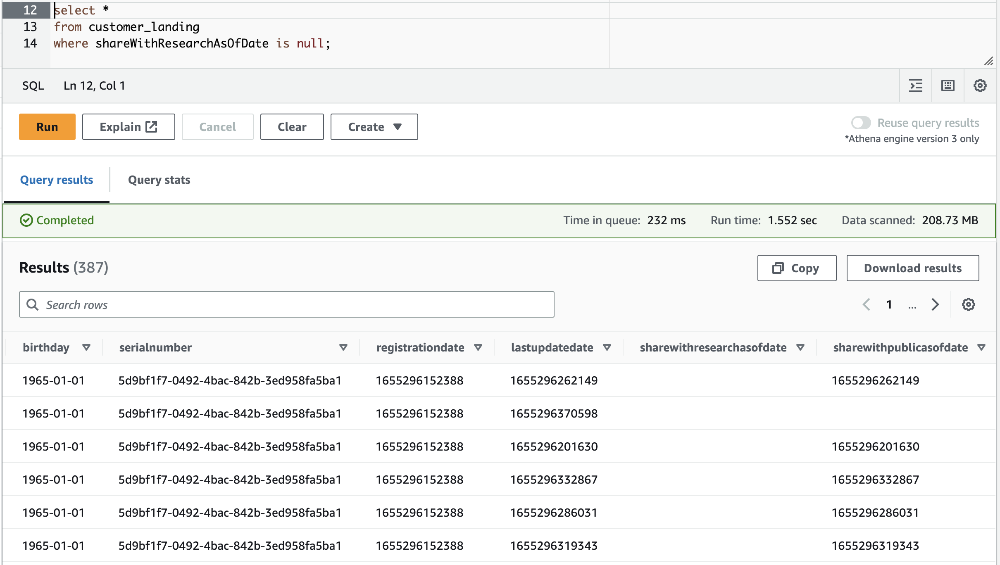
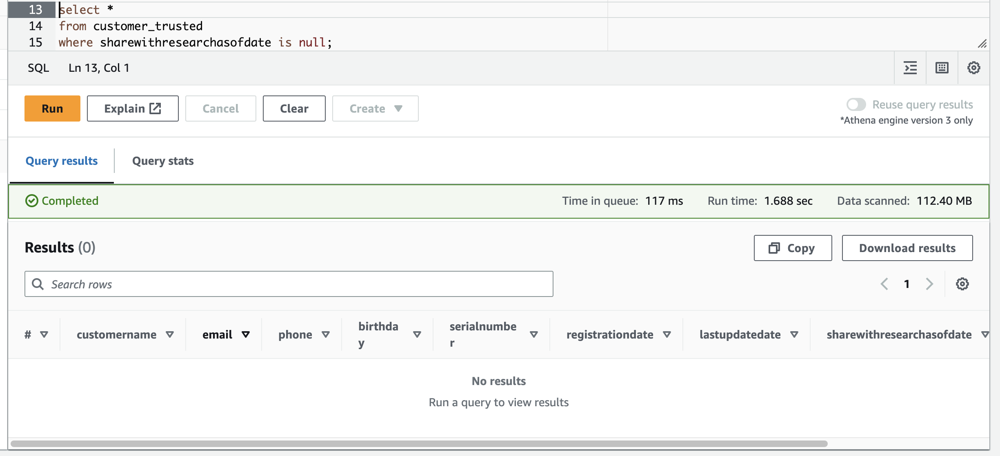

# STEDI_Human_Balance_Analytics

This repository contains a data pipeline implemented using AWS Glue, designed to move and transform data through different stages from "landing" to "trusted" and finally to "curated." The pipeline primarily deals with JSON data stored in Amazon S3 buckets. Below is an overview of the structure and purpose of each directory and file in this repository:

### Landing:
The "landing" directory contains JSON data stored in Amazon S3 buckets. The data is represented as multiple JSON files with schemas described by corresponding SQL files. The SQL files contain CREATE EXTERNAL TABLE statements, specifying how to interpret the data's structure and store it in the "landing" zone.

An example of the Glue Table in AWS Athena:

### Trusted:
The "trusted" directory contains Python scripts that use AWS Glue to perform data transformations and move data from the "landing" zone to the "trusted" zone. The scripts create dynamic frames from the JSON data in the landing zone, apply transformations, and write the resulting data into new JSON files in the "trusted" zone.

An example of the filtered Glue Table in AWS Athena:

### Curated:
The "curated" directory contains Python scripts that further transform and curate data from the "trusted" zone, producing refined and ready-to-use data in the "curated" zone. The scripts often involve joining the "trusted" data with other curated data from a database table, dropping unnecessary fields, and writing the result into new JSON files in the "curated" zone.

For more detailed information, refer to the individual Python scripts in the "trusted" and "curated" directories. Additionally, ensure that you have the necessary AWS Glue permissions and configurations set up to execute the pipeline successfully.
